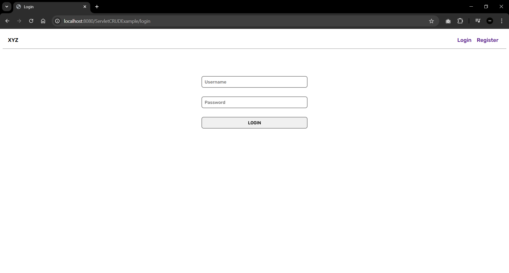
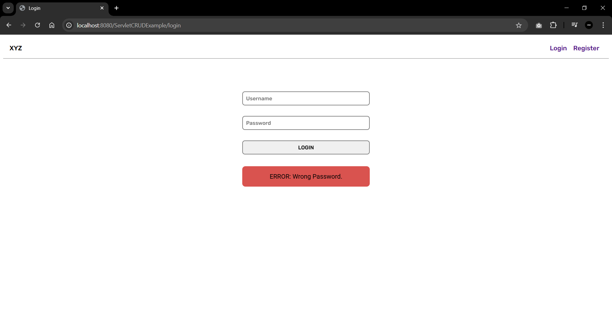
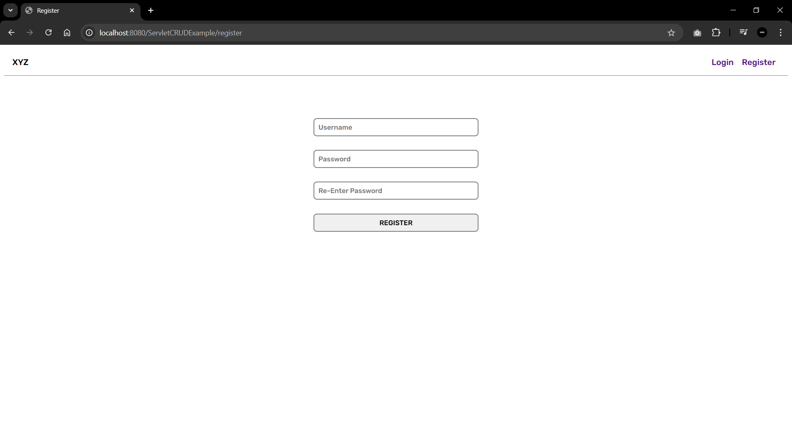
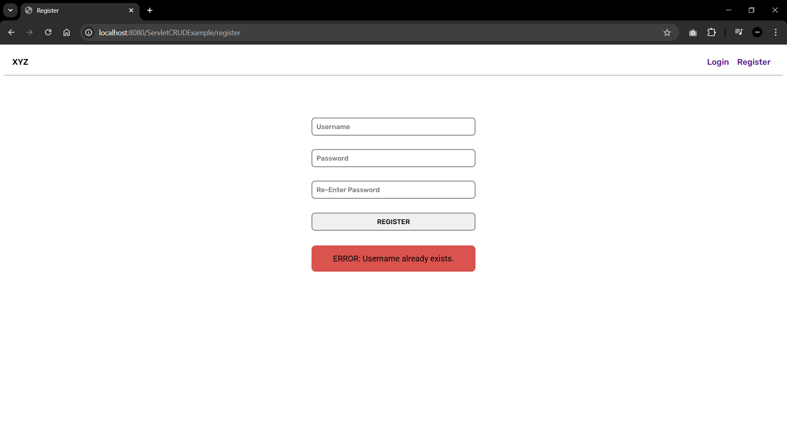
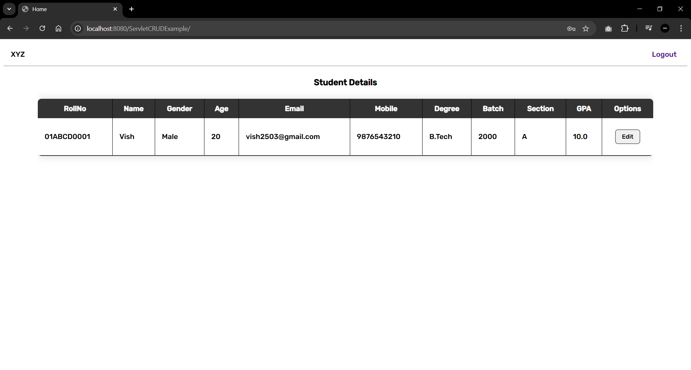
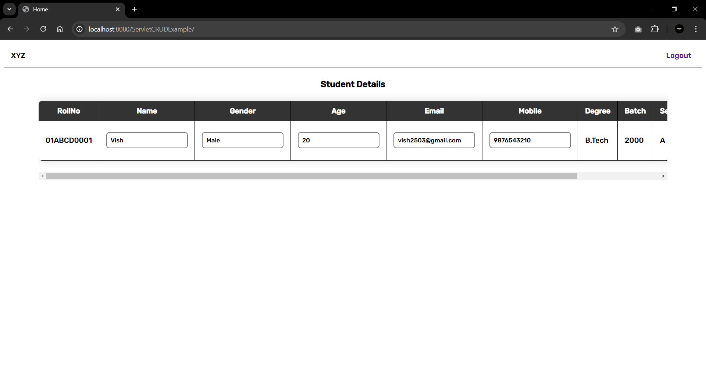

# Simple CRUD Project in Java with Servlets

This is a basic CRUD (Create, Read, Update, Delete) web application built with Java using Servlet technology. This project serves as an example for implementing CRUD functionality with Servlets and a MySQL database.

### Features
- Login, Logout and New Registration functionality with error handling.
- Create, Read, Update and Delete items from a MySQL database.
- Seperate functionalities for normal users and administrators.

## Prerequisites

To run this application, ensure you have the following installed:
- NetBeans 8.2
- JDK (Java Development Kit) 8
- GlassFish 4.1.1 Server
- MySQL 8 or higher
- MySQL Connector 9.0.0 jar

## Installation and Setup

### Step 1: Clone the Repository 
```bash
git clone https://github.com/your-username/servlet-crud-example.git 
cd servlet-crud-example
```

### Step 2: Configure the Database
1. Create a MySQL database named servlet_crud_example.

2. Run the following SQL commands to create the required table:
```sql
CREATE TABLE user (
	userID int NOT NULL AUTO_INCREMENT,
  	username varchar(255) NOT NULL,
  	password varchar(255) NOT NULL,
  	isAdmin char(1) DEFAULT 'F',
  	PRIMARY KEY (userID),
  	UNIQUE KEY username (username),
  	CONSTRAINT true_or_false CHECK (((isAdmin = 'T') or (isAdmin = 'F')))
);
```
```sql
INSERT INTO user (username, password, isAdmin) VALUES ('admin', 'admin', 'T');
```
```sql
CREATE TABLE student (
	userid int,
	rollno varchar(255),
	name char(255),
	gender char(255),
	age int,
	email varchar(255),
	mobile varchar(255),
	degree varchar(255),
	batch varchar(255),
	section char(2),
	gpa float,
	FOREIGN KEY (userid) REFERENCES user(userid)
);
```

3. Update database credentials in the code:
   - Open UserDao.java and StudentDao.java.
   - Set your MySQL username, password, and database name.

### Step 3: Run and Access the Application.
Run the Java Project using NetBeans and access the web application at `http://localhost:8080/ServletCRUDExample`.

## Screenshots













 file for more details.
